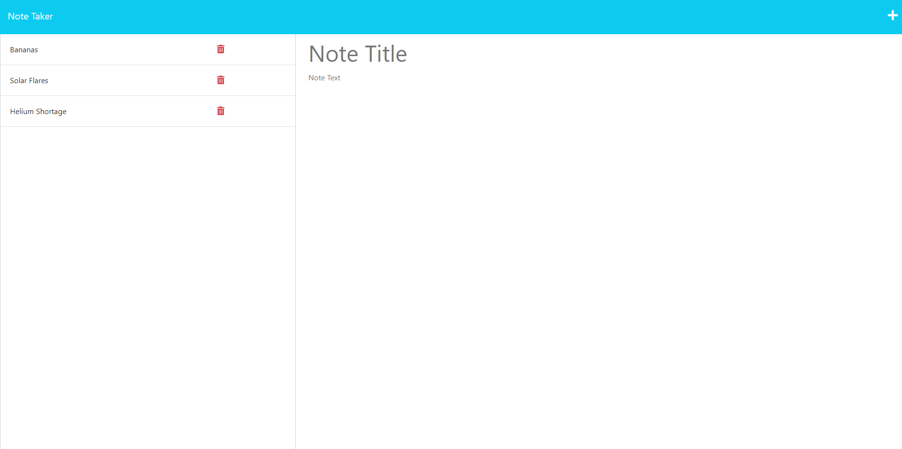

# Note Taker

## Description

This is an app that can you used to write and store notes.

To use this page, click the "Get Started" button. From there, you will see a list of previously saved notes on the left hand side.

You are able to enter text in the "Note Title" and "Note Text" fields. When you're done writing your note, click the floppy disc icon that appears at the top right, and the note will be added to the list on the left.

[This is a link to the working webpage](https://note-taker-814.herokuapp.com/)

Here is a screenshot of the webpage:

## Tasks

For this project, I was given all of the front end code and I had to write the back end code. All of my work was done in the server.js file.

## What I Learned

This was one of the more challenging assignments for me, so I learned a lot in the process. The biggest things for me were knowing when my code is just looking at a filve versus when it's actually altering a file, and knowing whether or not something needed a json command.